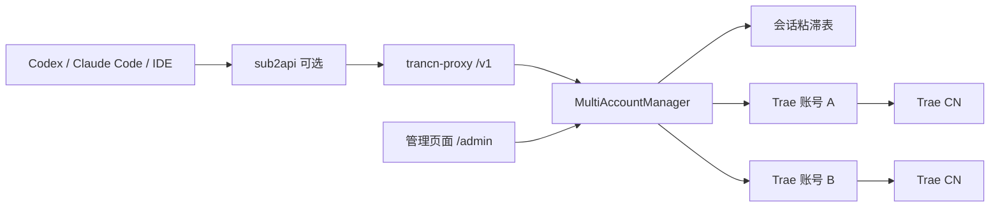

# 多账号设计

## 目标

`trancn-proxy` 对外保持单一的 OpenAI Chat、OpenAI Responses 和 Anthropic Messages API。服务内部维护多个已获授权的 Trae CN 账号，并为每个请求选择一个固定账号完成整个上游调用。

sub2api 只需配置一个 OpenAI 兼容上游：`http://trancn-proxy:9220/v1`。它不需要感知或重复配置底层 Trae 账号。

## 边界

本项目负责账号授权、凭据刷新、健康状态、基础负载选择和会话粘滞。它不负责用户级 API Key、计费、配额、复杂分布式调度或跨实例一致性；这些能力仍可由 sub2api 提供。

## 架构

每个请求在开始时获得 `AccountLease`：其中包含固定账号、该账号的 `TraeClient` 和并发槽位。响应成功、异常或客户端取消时都会释放槽位。流式响应一旦写出内容，不允许中途切换账号。

## 账号持久化

默认目录为 `~/.config/trancn-proxy`，可通过 `--data-dir` 覆盖。

- `accounts.json` 保存版本、负载策略、会话 TTL 和账号列表。
- 首次启动会把旧的 `auth.json` 迁移成别名为 `default` 的账号。
- 每个账号有不可变 UUID、唯一别名、`TraeAuthData`、设备身份、启停状态、优先级、最大并发和运行历史。
- 写入使用临时文件和原子替换；非 Windows 平台权限为 `0600`。
- 单个数据目录只允许一个服务实例，避免多个刷新器轮换同一 refresh token。

独立网页登录账号永不回写 IDE 的 `storage.json`。从 IDE 导入的旧账号仅作为迁移兼容路径。

## 调度与会话

选择顺序：健康的粘滞账号、优先级最小的账号、再按当前 in-flight 数最少与最久未使用排序。`balanced` 模式优先按 in-flight 和最近使用时间选择；`priority` 是默认模式。

会话 ID 的优先级：

1. `X-Trancn-Session-Id`
2. OpenAI / Responses 请求的 `user`
3. Anthropic `metadata.user_id`

粘滞键只保存哈希，不保存用户原始标识。默认 TTL 为一小时；没有稳定会话标识时仅做负载选择。进程重启后会话自然重新分配。

## 账号生命周期

- access token 在到期前一小时由账号专属刷新锁刷新。
- `invalid_grant`、refresh token 过期会禁用账号并标为需要重新登录。
- 401/403 在当前账号上强制刷新一次；若响应尚未开始，可重新选择一次其他健康账号。
- 429 或持续网络错误会临时冷却账号；已开始的 SSE 不进行故障切换。

当前 Trae `llm_utils_chat` 仍会忽略部分模型选择。每次请求继续通过上游 `metadata.model` 验证实际模型，不能用多账号机制掩盖模型不匹配。

## 管理面

管理端使用独立 `TRANCN_ADMIN_KEY`，与业务 `TRANCN_API_KEY` 分离。`/admin` 仅展示脱敏账号信息，不返回 access token 或 refresh token。

管理端支持：JSON 导入和导出、账号启停、优先级设置、刷新、测试、删除以及 OAuth2 网页登录。

网页登录使用 PKCE、随机 `state` 和五分钟有效的 pending login。回调完成后才创建账号，防止多个浏览器授权流程串号。

## 非目标

- 不引入 Redis、数据库或多实例分布式锁。
- 不实现下游用户 API Key、计费和账号池授权。
- 不承诺工具调用、多模态或完整 Anthropic thinking 语义。